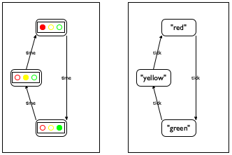

# Fixed Size Data
## 1.1 The Arithmetic of Numbers
In Racket, we call functions using the syntax
```
(function arg1 arg2 ... argn)
```
Arithmetic is done in this way. To add 2 and 3, we do:
```
(+ 2 3 )
5
```

Racket supports a lot of other mathematical operations/functions: ```+, -, *, /, abs, add1, ceiling, denominator, exact->inexact, expt, floor, gcd, log, max, numerator, quotient, random, remainder, sqr, tan```

**Interesting Racket feature**: Racket / BSL distinguishes exact and inexact numbers. Right click on a fraction e.g. `(/ 4 6)` to see its representation as a precise fraction, improper fraction, or mixed decimal. Racket tells you an inexact number as marked by `#i` before the number e.g. `(sqrt 2)`.  
## 1.2 The Arithmetic of Strings
To do string arithmetic, BSL provides a variety of functions:
``` scheme
(string-append "hello" "world") ; outputs "helloworld"

(string-length "hi") ; outputs 2

(string-ith "hi" 0) ; get i-th letter of a string, outputs "h"

(number->string 42) ; convert 42 to string "42"

(substring "hello world" 0 2) ; outputs "hel"
```

## 1.7 Predicates: Know Thy Data
A predicate is a function that consumes a value and returns a boolean pertaining to whether it belongs to a class of data. Predicates often contain a "?" suffix.
``` scheme
(number? 4)
#true
```
**Predicates are useful for error checking**
``` scheme
; Check if a value is a string first before asking for its string length

(define in ...)
 
(if (string? in) (string-length in) ...)
```

Examples of type predicates: `number?`, `string?`, `image?`, `boolean?`.

Examples of numeric predicates:
`integer?`, `rational?`, `real?`, `complex?`

## 2.1 Functions
Two types of definitions in Racket:
- Constant definitions `(define variable Expression)`
- Function definition `(FunctionName Arg1 .. ArgN Expression)`
    - Example function that multiplies input by 10: 
    
        ``` scheme
        (define (ff a)
        (* 10 a))
        ```

## 2.5 Programs
Programs are just a bunch of functions and constant definitions.
- Batch program: Consume inputs and computes a result
- Interactive program: Takes input, output, then takes more input, outputs more, etc. Such inputs are called "events" and the program is called an "event-driven" program. The event-driven program calls various functions depending on the event, which are called "event handlers".

### Batch programs
Use `(require 2htdp/batch-io)` to import functions for reading/writing files

To read and write files:
``` scheme
(write-file "sample.dat" "212")
"sample.dat"

(read-file "sample.dat")
"212"
```


## 3.1 Designing Functions
Model-view-controller (MVC): Separating data processing from information parsing, turning data into useful information.

Key concept - separation of data and information

A number can mean many things - temperature in Celsius or Fahrenheit, number of apples, number of characters in a string. Therefore, it is useful to provide a **data definition**:
``` scheme
; A Temperature is a Number.
; interpretation: represents Celsius degrees
```

When designing a function, write out what types of data it takes in, followed by `->` and the output type, and what it does in plain English. For example:
``` scheme
; Number -> Number
; computes the area of a square with side len 
; given: 2, expect: 4
; given: 7, expect: 49
(define (area-of-square len) 0)
```

## 3.5 On Testing
To test the correctness of a function, use the functions `(check-expect f out)`. Example:
``` scheme
; Number -> Number
; converts Fahrenheit temperatures to Celsius temperatures 
 
(check-expect (f2c -40) -40)
(check-expect (f2c 32) 0)
(check-expect (f2c 212) 100)
 
(define (f2c f)
  (* 5/9 (- f 32)))


; Output: All 3 tests passed!
```

## 4.1 Programming With Conditionals
Conditional statement:
``` scheme
(cond
  [ConditionExpression1 ResultExpression1]
  [ConditionExpression2 ResultExpression2]
  ... 
  [ConditionExpressionN ResultExpressionN])
  [else DefaultResultExpression]) ;optional

```

**We always use `cond` for situations when we wish to remind the reader of our code that some distinct situations come directly from data definitions**. In a situation with two cases, just use 
```scheme
(if (condition) 
    (value_if_true) 
    (value_if_false))
```

It is recommended to use the `else` clause in `cond` to avoid unexpected behavior from all of the conditions not being met.

## 4.7 Finite State Worlds
Finite state machine / automata: A system with a set number of states which transition into other states. 

**Example**: A traffic light which ONLY transitions from red to green, green to orange, and orange to red. 


## 5.4 Defining Structure Types
Structures like `posn` (a struct with x and y attributes) are defined using `define-struct`. This is how `posn` is defined:
``` scheme
(define-struct posn [x y])
```

This is how any struct is defined in general:
``` scheme
(define-struct StructureName [FieldName ...])
```

The names enclosed in square brackets are called *fields*. A structure that has been created is called a *structure instance* or *structure*. A *structure type* refers to the collection of all possible structure instances.

**A `define-struct` defines THREE functions simultaneously**:
- A constructor, a function that creates structure instances. **It's always `make-struct`, the word "make" followed by a hyphen, followed by the struct name, followed by all of the field values e.g. `(make-posn 1 2)` creates a coordinate (1,2).**
- A selector per field, a function which extracts the value of the field from the structure instance. **It's always `struct-field`, the struct name, followed by a hyphen, followed by the field name, followed by the structure instance (e.g. `(posn-x myCoord)`)**.
- A structure predicate, a function that tells if an instance is of the structure type. **It's always the `struct?`, the struct name with a question mark, followed by the structure instance (e.g. `(posn? myCoord)`)**

Example code using structs:
``` scheme
(define-struct entry [name phone email]) ; Define "entry" struct type with 3 fields: name, phone, email
(define a (make-entry "Al Abe" "666-7771" "lee@x.me"))  ; Create struct instance
(define a-name (entry-name a)) ; Selector usage:  Get the name of the instance structure and store as another variable


a-name ; "Al Abe"
(entry-email a) ; Selector usage: "lee@x.me"
(entry? a) ; Predicate usage: "#true"
```


### Using Structures
Structures can be used within other structure definitions. Example of a bouncing ball which contains a position field and a velocity field (which we first define):
``` scheme
(define-struct vel [deltax deltay])

(define-struct balld [location direction])

(define ball1
    (make-ball (make-posn 30 40) (make-vel -10 5))) ;defines a ball located at (30,40) with velocity components 10 units left and 5 units down
```
The `balld` struct is a **nested** data representation of balls because the `location` and `direction` fields are structs of their own. 

The alternative is the **flat** data representation, in which all of the fields are explicitly shown:
``` scheme
(define-struct ballf [x y deltax deltay])
```

## 5.5 Computing with Structures
In the structure definition of the ball containing two fields (location and velocity):
``` scheme
(define-struct ball [location velocity])
```
There are two laws introduced:
``` scheme
(ball-location (make-ball l0 v0)) == l0

(ball-velocity (make-ball l0 v0)) == v0
```
In order to get the x and y components of the location, we need to "nest" our selector queries:

``` scheme
(vel-deltax (ball-velocity (make-ball l0 v0))) == vX
```

## 5.6 Programming With Structures

Example of good documentation for a structure of a Ball2D and Ball1D:

```scheme
; A Vel is a structure: 
;   (make-vel Number Number)
; interpretation: (make-vel dx dy) means a velocity of 
; dx pixels [per tick] along the horizontal and
; dy pixels [per tick] along the vertical direction
(define-struct vel [deltax deltay])

; A Ball-1d is a structure:  
;   (make-ball Number Number)
; interpretation 1 distance to top and velocity 
; interpretation 2 distance to left and velocity 

; A Ball-2d is a structure: 
;   (make-ball Posn Vel)
; interpretation: a 2-dimensional position and velocity

(define-struct ball [location velocity])
```
Ball1D and Ball2D have different meanings, but they use the same struct definition `ball`. We just pass different types of fields into creating them: `location` of a Ball1D takes in `Number` but a Ball2D takes in `Posn`. **Generally, it is recommended that only one use is created for each structure**.

