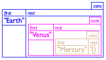
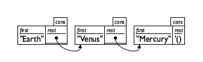

# Arbitrary Large Data

## 8.1 Creating Lists
In BSL, lists are represented by `'()`. To add an item to a list, use `cons`. 

Below is an example of a list created using `'()` first and then `cons` repeatedly to join items. 
``` scheme
(cons "Earth"
  (cons "Venus"
    (cons "Mercury"
      '())))
```
Which corresponds to a "nested" structure as shown below:



Which is also equivalently represented using arrows:



A list can contain values of any type:

``` scheme
(cons "Robbie Round"
  (cons 3
    (cons #true
      '())))
```

## 8.2 What is `'()`, what is `cons`
`'()` is a constant, a representation of an empty list. Its predicate is `empty?`. 
``` scheme
; Any -> Boolean
; is the given value '()
(define (empty? x) ...)
```
Usage:
``` scheme
> (empty? '())
#true

> (empty? 5)
#false

> (empty? "hello world")
#false

> (empty? (cons 1 '()))
#false

> (empty? (make-posn 0 0))
#false
```

To access elements in a list, Racket lets you only access the first item with `first`  and the rest of the list with `rest`. In Racket, they are synonymous with `car` and `cdr` respectively. All list primitives:
``` scheme
;a special value, mostly to represent the empty list
'()

;a predicate to recognize '() and nothing else
empty?

a checked constructor to create two-field instances
cons

;the selector to extract the last item added
first

;the selector to extract the extended list
rest


;a predicate to recognize instances of cons
cons?
```

## 9.0 Designing with Self-Referential Data Definitions
Self-referential (recursive) functions correspond to proof by induction in mathematics.

The following is a simple function that uses recursion to count the number of strings in a list:
``` scheme
; count number of strings in a list of strings
(define (how-many alos)
  (cond
    [(empty? alos) 0]
    [else (+ (how-many (rest alos)) 1)]))
```
A recursive function works using multiple cases. It first establishes a **base case** (if the list is empty, return 0). The **inductive step** self-references the function with the rest of the list and involves a **combinator**, which combines the values into the proper result. 

## 9.2 Non-empty Lists
Consider a function that consumes a list of numbers and produces the average of the numbers in the list. This task can't be easily done in a single function with a `cond` expression, and we must break up the task into three subtasks: 

1. A function that sums the numbers in the list
2. A function that counts the number of items in the list
3. A function that divides the sum by the number of items in the list

The code implementation of this is shown below.
``` scheme
; List-of-temperatures -> Number
; computes the average temperature 
(define (average alot)
  (cond
    [(empty? alot) "Please enter a list of numbers"]
    [else (/ (sum alot) (how-many alot))]))
 
; List-of-temperatures -> Number 
; adds up the temperatures on the given list 
(define (sum alot)
  (cond
    [(empty? alot) 0]
    [else (+ (first alot) (sum (rest alot)))]))
 
; List-of-temperatures -> Number 
; counts the temperatures on the given list 
(define (how-many alot)
    (cond
    [(empty? alot) 0]
    [else (+ 1 (how-many (rest alot)))]))


; Tests
(check-expect
  (average (cons 1 (cons 2 (cons 3 '())))) 2)
(check-expect
  (average '()) "Please enter a list of numbers")
  ```

An alternative method of summing list presented uses a different first clause (condition). This function only accepts non-empty lists (it will raise an error):
``` scheme
(define (sum ne-l)
  (cond
    [(empty? (rest ne-l)) (first ne-l)]
    [else (+ (first ne-l) (sum (rest ne-l)))]))
```

## 9.3 Natural Numbers
BSL provides functions that consume lists and produce them. One such function is `make-list` which consumes a number `n` and some value `v`, producing a list containing `n` number of elements of `v`:
```scheme
> (make-list 2 "hello")
(cons "hello" (cons "hello" '()))

> (make-list 3 #true)
(cons #true (cons #true (cons #true '())))

> (make-list 0 17)
'()
```
The input `n` only accepts natural numbers, whose data definition is the counting numbers from 0 to infinity (0, 1, 2, 3, ...):
``` scheme
; An N is one of: 
; – 0
; – (add1 N)
; interpretation represents the counting numbers
```
To design a function like `make-list`, use functions and predicates that involve base case (`0`) and the rest of the cases (`add1 N`). The `add1` and `sub1` functions are equivalent to `(+ 1 n)` and `(- n 1)` but are used to signal that the addition is special (i.e. involved in recursion). Also use the predicates `positive?` and `zero?` to check whether we are at the base case 0. 

## 9.4 Russian Dolls (Recursion on Structs)

This section generalizes recursive techniques on custom defined structures, such as a "Russian doll"

``` scheme
; An RD (short for Russian doll) is one of: 
; – String 
; – (make-layer String RD)
(define-struct layer [color doll])
```
To make a Russian doll, we nest layers:
``` scheme
(make-layer "yellow" (make-layer "green" "red"))
```

An example function to work on Russian dolls is to generate a single string joining all of the colors of the Russian doll. This is the function that recursively loops into the doll to find the inner one using selectors `layer-doll`, which is analogous to `rest` or `cdr` in a list, and `layer-color`, which is analogous to `first` or `car`.
``` scheme
; RD -> String
; consumes a Russian doll and produces a string of all colors, separated by a comma and a space
(define (colors rd)
  (cond
    ; base case - the doll is a String type, not another layer
    ; return inner doll string
    [(string? rd)  rd]
    [else
     (string-append (layer-color rd) ", " (colors (layer-doll rd)))]))
```

## 9.6 A Note on List and Sets
There is no special definition of a set in BSL, but we can define a Son (**set of numbers**) in two different ways:
```scheme
; A Son.L is one of: 
; – empty 
; – (cons Number Son.L)
; 
; Son is used when it 
; applies to Son.L and Son.R
  

; A Son.R is one of: 
; – empty 
; – (cons Number Son.R)
; 
; Constraint If s is a Son.R, 
; no number occurs twice in s
```
From the definitions above, both say that a set is represnted as a list of numbers. The second definition `Son.R` has a constraint that no number can occur more than once in the list.

We can define two notions about sets from this:
``` scheme
; Son (set of numbers)
; The Empty Set
(define es '())
 
; Number Son -> Boolean
; The membership test
; is x in s
(define (in? x s)
  (member? x s))
```
Summary table of characteristics and differences betewen lists and sets:

property|lists|sets
---|---|---|
membership|one among many|critical
ordering|critical|irrelevant
|# of occurrences|sensible|irrelevant
size|finite but arbitrary|finite or infinite

# 10.2 Structures in Lists
The following is a data structure describing the name, pay rate, and number of hours worked, for an employee:
``` scheme
(define-struct work [employee rate hours])
; A (piece of) Work is a structure: 
;   (make-work String Number Number)
; interpretation (make-work n r h) combines the name 
; with the pay rate r and the number of hours h
```
To put it into a list, we use
``` scheme
; Low (short for list of works) is one of: 
; – '()
; – (cons Work Low)
; interpretation: an instance of Low represents the 
; hours worked for a number of employees

Examples:
'() ; Empty Low
(cons (make-work "Robby" 11.95 39)
      '()) ; Low with one worker
(cons (make-work "Matthew" 12.95 45)
      (cons (make-work "Robby" 11.95 39)
            '())) ; Low with two workers
```

To design a function that works on a list of structures, use the **selectors**. Template:
``` scheme
(define (wage*.v2 an-low)
  (cond
    [(empty? an-low) ...]
    [(cons? an-low)
     (... (first an-low) ...
      ... ... (work-employee (first an-low)) ...
      ... ... (work-rate (first an-low)) ...
      ... ... (work-hours (first an-low)) ...
      (wage*.v2 (rest an-low)) ...)]))
```
The above example is quite long. We can split the processing of the `work` structure into a separate function. The recommended template is thus:
```scheme
(define (wage*.v2 an-low)
  (cond
    [(empty? an-low) ...]
    [(cons? an-low)
     (... (for-work (first an-low))
      ... (wage*.v2 (rest an-low)) ...)]))
 
; Work -> ???
; a template for processing elements of Work
(define (for-work w)
  (... (work-employee w) ...
   ... (work-rate w) ...
   ... (work-hours w) ...))
```
